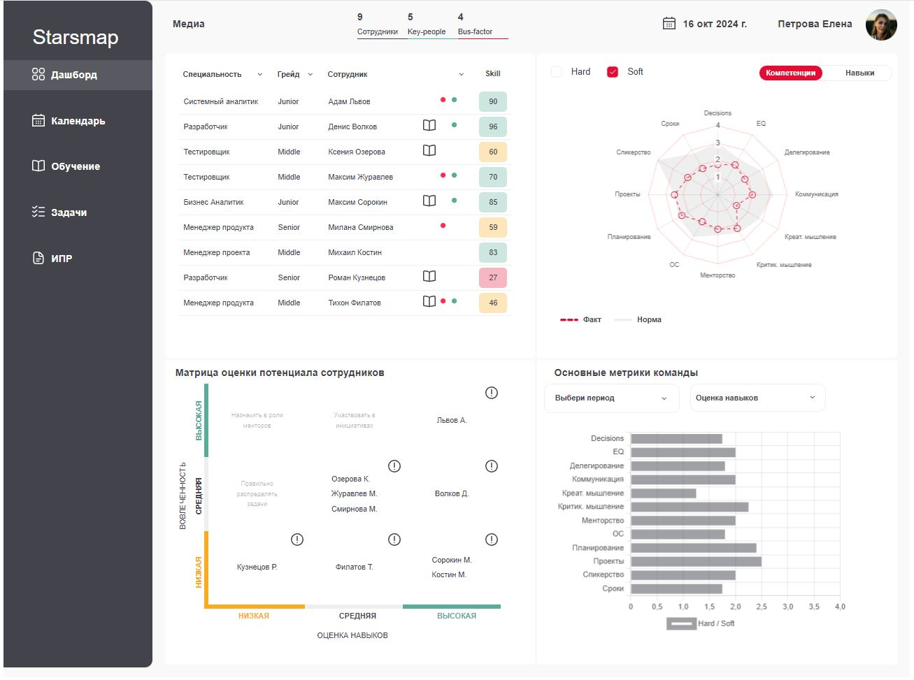

# Проект "Rosbank"

[**Ссылка на сайт**](https://hackathon-rosbank.github.io/rosbank-frontend/)

[**Макет Фигма**](https://www.figma.com/design/2WsogizTYlKMvT7U9Ijbjk/%D0%A0%D0%BE%D1%81%D0%B1%D0%B0%D0%BD%D0%BA_%D0%B4%D0%B0%D1%88%D0%B1%D0%BE%D1%80%D0%B4-%D0%B4%D0%BB%D1%8F-%D1%80%D0%B0%D0%B7%D1%80%D0%B0%D0%B1%D0%BE%D1%82%D1%87%D0%B8%D0%BA%D0%BE%D0%B2?node-id=0-1&node-type=canvas&t=vJZS5d5IILDJN8uM-0)

[**Ссылка на билд**](https://github.com/k0t1k777/rosbank-frontend)

## О команде

[Николай](https://github.com/k0t1k777) [<span></span>](https://t.me/ni_kolyaus)

## Стек технологий


## Установка и запуск

Клонируйте репозиторий и перейдите в его директорию:

```bash
git clone git@github.com:hackathon-Rosbank/rosbank-frontend.git
cd rosbank-frontend
```

Установите зависимости:

```bash
npm i
```

Для запуска в режиме разработки выполните команду:

```bash
npm run dev
```

Приложение будет доступно по адресу: [http://localhost:5173](http://localhost:5173/)

## Ссылки на материалы

**Библиотеки**

В приложении использовались следующие библиотеки:

- simplebar-react
- framer-motion
- classnames
- react-svg
- date-fns
- dayjs

## SCSS

Все основные переменные находятся по пути `src/styles/variables.scss`. Переменные, начинающиеся с

- font - переменные семейства шрифтов
- color - являются цветовой палитрой приложения

Все основные миксины находятся по пути `src/styles/mixins.scss`. Миксины, начинающиеся с

- reset - обнуляют стандартные стили
- text - являются стилями для типографики на основе UI-kit

## Примечание

Проект сверстан для просмотра в десктопных браузерах и экранах с разрешением 1440px и более.

## Скриншоты

